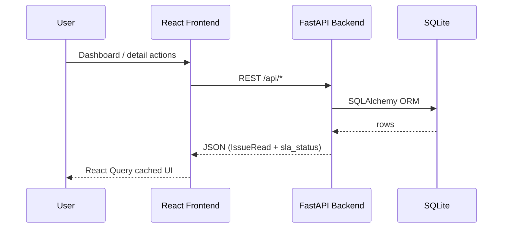
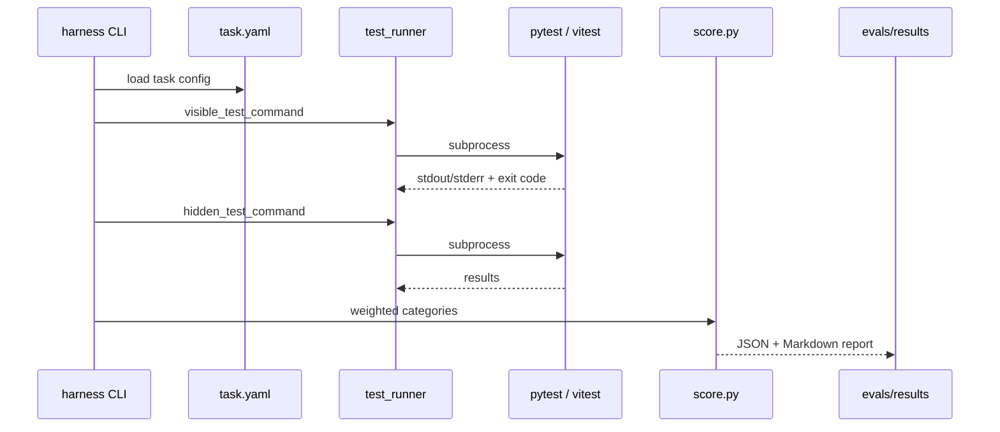

# Architecture

This document describes how IssueFlow and the eval harness fit together. It reflects the code as implemented — not a roadmap.

## System overview

IssueFlow is a small issue-tracking product used as the **target codebase** for coding-agent eval tasks. A separate **eval harness** loads task definitions, runs visible and hidden-style test commands as subprocesses, scores results deterministically, and writes JSON/Markdown reports.





---

## Backend (`apps/issueflow-backend/`)

### Stack

| Piece | Role |
|-------|------|
| **FastAPI** | HTTP API, OpenAPI docs at `/docs` |
| **SQLAlchemy 2.x** | ORM, session management |
| **SQLite** | File DB (`issueflow.db`), seeded on startup |
| **Pydantic v2** | Request/response schemas |

Entry point: `app/main.py` — lifespan initializes DB and seed data, mounts routers under `/api`.

### Layering

```
app/
  routes/          HTTP handlers (thin)
  crud.py          Persistence + domain orchestration
  services/        Pure/domain logic
  models.py        SQLAlchemy models
  schemas.py       Pydantic DTOs
  database.py      Engine, SessionLocal, init_db
  types.py         UTCDateTime type decorator for SQLite
```

Routes delegate to **crud** for transactions. **Services** hold reusable rules so eval tasks can target one module without duplicating logic in handlers.

### Domain services

#### `services/state_machine.py`

- Defines `ALLOWED_TRANSITIONS` for `open`, `in_progress`, `blocked`, `resolved`, `closed`
- `validate_transition(old, new)` — raises `StateTransitionError` on illegal hops
- `assert_issue_editable(status, reopen=...)` — blocks generic PATCH on closed issues while allowing reopen via status endpoint

Used by crud when updating issue status or fields.

#### `services/sla.py`

- `compute_sla_status(issue, now=None)` — returns `healthy`, `at_risk`, `overdue`, or `closed`
- Priority windows from `created_at`: urgent 24h, high 72h, medium 7d, low 14d
- `at_risk` when elapsed ≥ 80% of window
- Resolved/closed issues short-circuit to SLA `closed`
- UTC normalization via `_ensure_utc` for naive/aware datetimes

#### `services/webhook_normalizer.py`

- Maps vendor field aliases (`summary`, `body`, `issueTitle`, …) to canonical title/description
- Normalizes priority strings and P0–P3 codes
- Returns confidence notes for ambiguous mappings
- Used before persisting webhook-created issues

#### `services/audit.py`

- Writes `ActivityEvent` rows for status changes, assignee changes, webhook ingest, etc.
- Supports idempotent status updates (no duplicate events when status unchanged)

#### `services/search.py`

- Filter/query helpers for issue list endpoints (status, priority, assignee, text search)

#### `services/clock.py`

- `utc_now()` — wall clock for production paths
- Eval and unit tests inject fixed `now` into pure functions instead

### API surface

| Router | Prefix | Purpose |
|--------|--------|---------|
| `routes/issues.py` | `/api/issues` | CRUD, status transitions, SLA on responses |
| `routes/comments.py` | `/api/issues/{id}/comments` | Comment threads |
| `routes/users.py` | `/api/users` | User list for assignee picker |
| `routes/webhooks.py` | `/api/webhooks/issues` | External issue ingest |

### Data models (high level)

- **User** — assignees and comment authors
- **Issue** — status, priority, timestamps (`created_at`, `resolved_at`, optional `due_at`)
- **Comment** — per-issue discussion
- **ActivityEvent** — audit trail
- **WebhookIngestLog** — low-confidence normalization records

---

## Frontend (`apps/issueflow-frontend/`)

### Stack

| Piece | Role |
|-------|------|
| **React 18** | UI components |
| **TypeScript** | Typed API client and props |
| **Vite** | Dev server, build, test runner host |
| **Tailwind CSS** | Utility styling |
| **TanStack React Query v5** | Server state, caching, mutations |

### Structure

```
src/
  api/           client.ts, types.ts, queryKeys.ts
  hooks/         useIssues.ts — queries and mutations
  components/    IssueList, IssueDetail, IssueFilters, SlaBadge, StatusBadge, ...
  pages/         DashboardPage, IssueDetailPage
  test/          Vitest setup
```

Vite dev server proxies `/api` to `http://127.0.0.1:8000`.

### Cache invalidation behavior

Central **query key factory** (`api/queryKeys.ts`):

- `queryKeys.issues.list(filters)` — filtered dashboard rows
- `queryKeys.issues.detail(id)` — single issue + comments
- `queryKeys.issues.lists()` — prefix for all list queries

Mutations in `hooks/useIssues.ts`:

1. **Patch** list caches via `setQueriesData` on the `issues.lists()` prefix (immediate UI update)
2. **Patch** detail cache for the affected issue id
3. **Invalidate** detail and list queries for server reconciliation (filter views drop rows that no longer match)

Same pattern for status, assignee, and comment mutations. Task 003 eval tests specifically probe this behavior in hidden Vitest suites.

Eval task 003 uses `vitest.eval-task003.config.ts` in the frontend package so Vitest resolves `@/` aliases and plugins correctly.

---

## Eval harness (`evals/harness/`)

### Components

| Module | Responsibility |
|--------|----------------|
| `task_loader.py` | Discover tasks, parse `task.yaml`, orchestrate grading |
| `test_runner.py` | Run shell commands with timeout, capture stdout/stderr |
| `score.py` | Map test results → category scores, failure mode heuristics |
| `report.py` | Write per-task and aggregate JSON/Markdown |
| `schemas.py` | Pydantic models for config and grade results |
| `run_task.py` | CLI: `python -m evals.harness.run_task` |
| `main.py` | Alternate entry if needed |

`scripts/run_all_evals.py` discovers all folders under `evals/tasks/` and writes `aggregate_summary.json`.

### Task configuration (`task.yaml`)

Each task defines:

- `id`, `title`, `description`, `difficulty`
- `target_files` — hints for agents/reviewers
- `setup_command` — optional install step
- `visible_test_command` / `hidden_test_command` — shell commands executed from repo root
- `scoring_weights` — mapped to harness categories (`correctness` → `visible_tests`, etc.)
- `timeout_seconds`, `expected_capabilities`, `common_failure_modes`

### Test execution

- Backend tasks (001, 002, 004): **pytest** via `evals/pytest.ini` and shared `evals/conftest.py` fixtures
- Frontend task (003): **Vitest** with config under `apps/issueflow-frontend/`

The runner parses pytest/Vitest summary lines for pass/fail counts. Timeouts zero out suite scores.

### Scoring

Weighted categories (defaults normalized from `task.yaml`):

| Category | Typical signal |
|----------|----------------|
| `visible_tests` | Visible suite pass rate |
| `hidden_tests` | Hidden suite pass rate |
| `regression_safety` | Both suites pass |
| `interface_contract` | No harness errors, suites completed |
| `determinism` | Hidden pass + no timeout/path issues |
| `code_quality` | Placeholder weight (no linter integration yet) |

`classify_failure_modes()` adds human-readable tags when suites fail (e.g. lifecycle regression, SLA boundary, cache consistency, webhook idempotency).

### Reports

Per-task files in `evals/results/`:

- `{task_id}_{run_type}.json` — machine-readable grade
- `{task_id}_{run_type}.md` — summary for reviewers

Aggregate run:

- `aggregate_summary.json` / `.md` — all tasks, average score, failed task list

---

## Why deterministic grading matters

Coding-agent evals only work if the same patch produces the same score on repeat runs. This harness:

- Uses fixed test commands declared in YAML (no LLM judge in the loop)
- Parses objective pass/fail counts from test runners
- Applies explicit weights from task config
- Labels runs (`golden_reference`, `agent_attempt`, `baseline`) for comparison

That makes regressions and overfitting visible — especially when visible passes but hidden fails.

---

## Related docs

- [EVAL_DESIGN.md](EVAL_DESIGN.md) — per-task capability breakdown
- [FAILURE_ANALYSIS.md](FAILURE_ANALYSIS.md) — how to read failures
- [evals/harness/README.md](evals/harness/README.md) — harness CLI details
