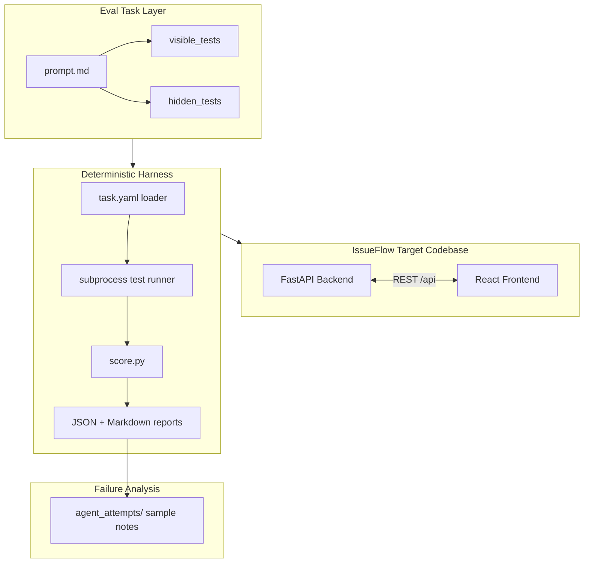

# SWE-Agent Eval Harness

A deterministic evaluation harness for coding-agent software engineering tasks, built around a full-stack issue-tracking app called **IssueFlow**.

This is an **independent portfolio project** inspired by coding-agent evaluation work (task design, visible/hidden test splits, deterministic grading). It is **not affiliated with Mechanize** or any employer.

## Why this exists

Coding agents are often graded on small, agent-visible test suites. That rewards patches that pass the happy path while missing lifecycle invariants, time boundaries, cache coherence, and idempotency. This repo demonstrates a complete eval loop: a realistic target app, scoped SWE tasks, a harness that grades patches deterministically, and sample failure analysis for review.

## What gets evaluated

Four Mechanize-style tasks exercise backend domain logic, time-based rules, frontend cache behavior, and webhook integration hardening. Each task has:

- A natural-language prompt (`evals/tasks/<task>/prompt.md`)
- **Visible tests** — smaller checks an agent might see or overfit
- **Hidden-style tests** — deeper invariants, boundaries, and edge cases (included in-repo for this demo benchmark)

The golden reference implementation passes all four tasks with **average score 1.00** (see `evals/results/aggregate_summary.json`).

## Four eval tasks

| Task | Focus |
|------|--------|
| `task_001_backend_state_transition` | Issue lifecycle, `resolved_at`, audit events, closed-issue guards |
| `task_002_sla_feature` | Deterministic SLA windows, timezone-safe boundaries, API exposure |
| `task_003_frontend_stale_state` | React Query cache coherence after mutations and filters |
| `task_004_webhook_normalization` | Messy payload aliases, idempotency, ingest logging |

Each task: `prompt.md`, `visible_tests/`, `hidden_tests/`, `expected_failures.md`, `task.yaml`.

## Three layers

| Layer | Location | Role |
|-------|----------|------|
| **1. IssueFlow target codebase** | `apps/issueflow-backend/`, `apps/issueflow-frontend/` | Full-stack app agents modify |
| **2. Coding-agent eval tasks** | `evals/tasks/` | Prompts, tests, expected failure notes |
| **3. Grading harness + failure analysis** | `evals/harness/`, `agent_attempts/` | Deterministic scoring, reports, sample attempt notes |



## Quickstart (Windows PowerShell)

Use a path **without apostrophes** when possible (e.g. `C:\dev\swe-agent-eval-harness`). Some Vite/Vitest tooling fails on paths like `Repo's...`.

```powershell
# Clone or copy to a clean path, then:
cd C:\dev\swe-agent-eval-harness
.\scripts\setup.ps1
.\.venv\Scripts\Activate.ps1

# Backend (terminal 1)
uvicorn app.main:app --reload --app-dir apps/issueflow-backend

# Frontend (terminal 2)
cd apps\issueflow-frontend
npm run dev
```

Open http://localhost:5173 (Vite proxies `/api` to the backend).

If your path has special characters, map a drive letter:

```powershell
subst Z: "C:\path\to\swe-agent-eval-harness"
Z:
.\.venv\Scripts\Activate.ps1
```

## Quickstart (macOS / Linux)

```bash
cd swe-agent-eval-harness
./scripts/setup.sh
source .venv/bin/activate

# Backend
uvicorn app.main:app --reload --app-dir apps/issueflow-backend

# Frontend (separate terminal)
cd apps/issueflow-frontend && npm run dev
```

## Run tests

### Backend (76 tests)

```powershell
pytest apps/issueflow-backend/tests -q
```

### Frontend

```powershell
cd apps/issueflow-frontend
npm test          # Vitest unit tests
npm run build     # Typecheck + production build
npm run e2e       # Playwright (installs browser on first run)
```

## Run evals

### One task

```powershell
python -m evals.harness.run_task --task evals/tasks/task_001_backend_state_transition --output-dir=evals/results
```

Replace the task folder for tasks 002–004.

### All tasks

```powershell
python scripts/run_all_evals.py --output-dir=evals/results
```

On PowerShell, use `--output-dir=evals/results` (equals form).

### Make targets (optional, macOS/Linux or Windows with make)

```bash
make test-backend
make eval TASK=task_001_backend_state_transition
make eval-all
```

## Golden reference output

The checked-in golden reference run (`evals/results/aggregate_summary.json`):

```
Tasks run:              4
Average overall score:  1.00
Failed tasks:           (none)

task_001_backend_state_transition   visible: pass  hidden: pass  score: 1.00
task_002_sla_feature                visible: pass  hidden: pass  score: 1.00
task_003_frontend_stale_state       visible: pass  hidden: pass  score: 1.00
task_004_webhook_normalization      visible: pass  hidden: pass  score: 1.00
```

See `evals/results/aggregate_summary.md` for the human-readable summary.

## Why visible tests are not enough

Visible suites are intentionally small — they check that basic wiring works (a status transition, an SLA label, a mutation hook, a standard webhook payload). Agents can pass them by patching routes or one component while leaving blocked transitions, SLA boundaries, React Query list caches, or webhook idempotency broken. Hidden-style tests target those gaps so scores reflect engineering quality, not test memorization.

## Why deterministic grading matters

The harness runs fixed shell commands from `task.yaml`, parses pytest/Vitest pass/fail output, and applies explicit weights — no LLM judge in the loop. The same patch should produce the same score on repeat runs. That makes regressions, visible-only overfitting, and environment issues (e.g. path-related Vitest failures) inspectable in JSON/Markdown reports under `evals/results/`.

## What makes this Mechanize-relevant

This repo mirrors eval-engineering concerns common in agent benchmarking:

- Scoped tasks with explicit target files and capability tags
- Visible vs hidden-style test separation
- Deterministic subprocess grading with weighted categories
- Structured JSON/Markdown reports for inspection
- Honest sample attempt analysis (not claimed as real model logs)

It shows how to design tasks, grade patches, and explain failures — without pretending to be an official Mechanize product.

## Limitations and future work

- No automated CI workflow in this repo yet
- No git worktree sandboxing for agent patches (manual apply today)
- Hidden tests are in-repo for transparency; production evals would keep them private
- Sample `agent_attempts/` notes are simulated, not real agent transcripts
- Docker isolation not included (local venv + npm install)
- Windows paths with apostrophes break some frontend test runners
- Scoring uses test pass rates + heuristics; no linter/static-analysis score yet

## Folder structure

```
apps/
  issueflow-backend/     FastAPI + SQLAlchemy + SQLite
  issueflow-frontend/    React + Vite + React Query
evals/
  tasks/                 Four eval tasks (prompt, tests, task.yaml)
  harness/               Grading CLI and report writers
  results/               Golden reference JSON/Markdown reports
  conftest.py            Shared eval pytest fixtures
agent_attempts/          Sample/simulated weak vs strong attempt analysis
scripts/
  setup.ps1 / setup.sh   One-time environment setup
  run_all_evals.py       Run all tasks + aggregate summary
docs (top-level):
  ARCHITECTURE.md        System design
  EVAL_DESIGN.md         Task and scoring design
  FAILURE_ANALYSIS.md    How to read failure patterns
```

## Publishing to GitHub

| Item | Recommendation |
|------|----------------|
| **Repo name** | `swe-agent-eval-harness` |
| **Description** | Deterministic coding-agent eval harness with IssueFlow — 4 SWE tasks, visible/hidden-style tests, JSON grading reports |
| **Topics** | `coding-agents`, `evaluation`, `fastapi`, `react`, `pytest`, `software-engineering`, `benchmark` |
| **Commit** | Source, docs, `evals/results/*_golden_reference.*`, `agent_attempts/`, configs |
| **Do not commit** | `.venv/`, `node_modules/`, `*.db`, `dist/`, `.pytest_cache/`, `test-results/`, `.env` |

Initialize git from a clean path if your clone directory contains apostrophes. Run `.\scripts\setup.ps1` (or `./scripts/setup.sh`) before first push.

## Further reading

- [ARCHITECTURE.md](ARCHITECTURE.md) — backend, frontend, harness design
- [EVAL_DESIGN.md](EVAL_DESIGN.md) — task breakdown and scoring
- [FAILURE_ANALYSIS.md](FAILURE_ANALYSIS.md) — sample failure patterns
- [agent_attempts/README.md](agent_attempts/README.md) — simulated attempt notes
- [apps/issueflow-backend/SETUP.md](apps/issueflow-backend/SETUP.md) — backend details
- [apps/issueflow-frontend/SETUP.md](apps/issueflow-frontend/SETUP.md) — frontend details
